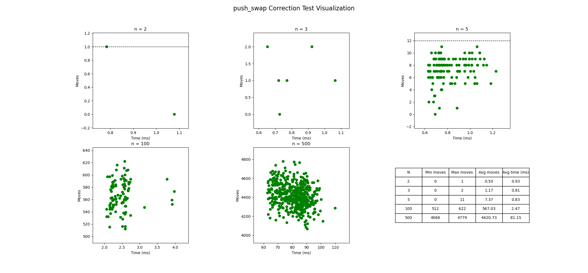
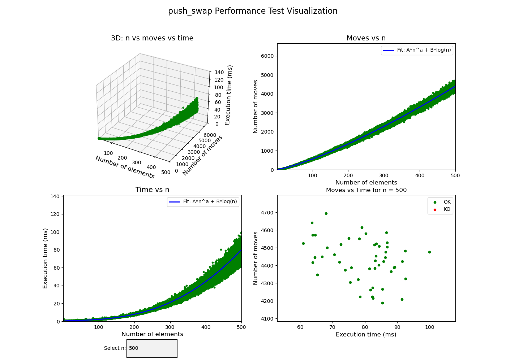
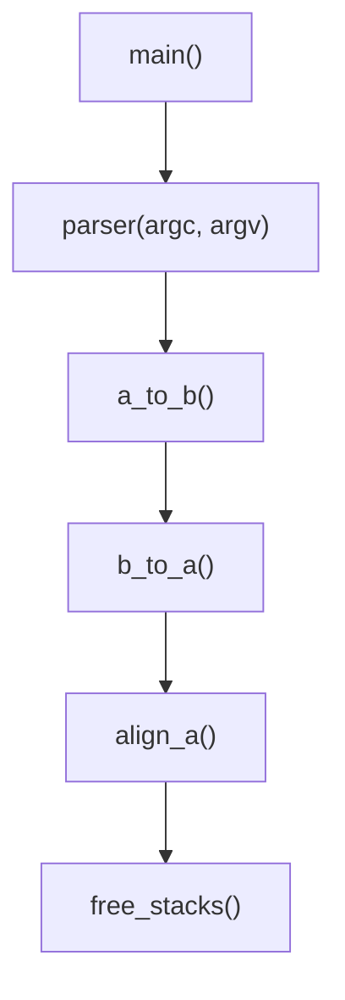
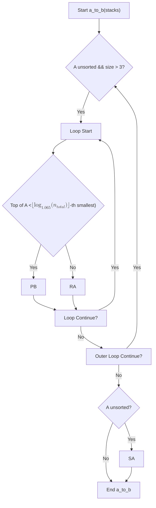
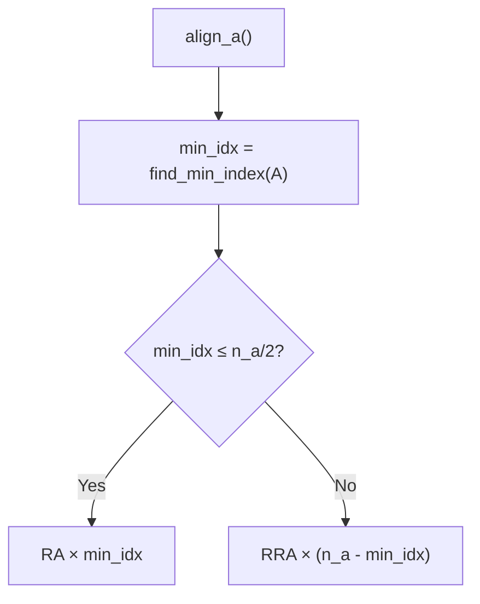

# Push_Swap

Push_Swap is a highly optimized sorting algorithm project written in C, designed under the strict 42 Norm standards. The project includes a main push_swap executable that sorts a list of integers using a limited set of operations, and a bonus checker program that validates the sequence of moves produced by push_swap.

---

## Installation

Clone the repository with submodules (e.g., libft) using the following command:

```bash
git clone --recursive https://github.com/cesardelarosa/push_swap.git
```

---

## Compilation

A Makefile is provided to compile both the main project and the bonus checker.

- **Compile the main push_swap executable:**

  ```bash
  make
  ```

- **Compile the bonus (checker) executable:**

  ```bash
  make bonus
  ```

- **Compile both:**

  ```bash
  make both
  ```

- **Clean object files:**

  ```bash
  make clean
  ```

- **Clean executables and object files:**

  ```bash
  make fclean
  ```

---

## Usage

- **Running push_swap:**

  Provide the list of integers as arguments:

  ```bash
  ./push_swap 3 2 1 6 5 8
  ```

- **Using the bonus checker:**

  You can pipe the output of push_swap to the checker to validate the moves:

  ```bash
  ./push_swap 3 2 1 6 5 8 | ./checker 3 2 1 6 5 8
  ```

---

## Performance

The project includes a performance graph (`images/performance_graph.png`) which displays the number of moves required across different executions based on the number of elements to sort. This graph helps in visualizing the efficiency and scalability of the algorithm.


## Performance

The project includes performance graph tests that illustrate the number of moves required across various executions based on the number of elements to sort. This graph demonstrates the efficiency and scalability of the algorithm.

<div align="center">

<strong>Performance Data</strong>

<a href="images/correction.png">
  
</a>

<a href="images/performance.png">
  
</a>

</div>

---

## Project Structure

```
push_swap/
├── bonus/                 # Bonus .c files (checker and related source files)
├── include/               # .h files for push_swap
├── libft/                 # Custom libft library
├── Makefile               # Build instructions
├── src/                   # Main .c files for push_swap
└── tests/                 # Test cases and scripts
```

---

## Algorithm Overview

The Push_Swap algorithm is divided into several logical parts. Below are the mermaid diagrams representing the workflow of each key component.

### Main Flow

The overall execution of the push_swap program follows this sequence:



### a_to_b

The `a_to_b` function pushes elements from stack A to stack B based on a dynamic pivot determined by logarithmic heuristics, ensuring that smaller elements are pushed first.



### b_to_a

After the partitioning is complete, the `b_to_a` function pushes elements back to stack A in the correct order, calculating the optimal rotations to minimize the number of operations.

```mermaid
flowchart TD
    Start["b_to_a(stacks)"] --> CheckBEmpty{"Is stack B empty?"}
    CheckBEmpty -- Yes --> End["Return"]
    CheckBEmpty -- No --> BestMove

    subgraph BestMove [Calculate Optimal Move]
        direction TB
        BM_Start["For each node in B:"] --> BM_InitVars["current_idx=0\nbest_cost=INT_MAX"]
        BM_InitVars --> BM_Loop{"current_idx < n_b?"}
        BM_Loop -- Yes --> BM_CalcTarget["target_idx = find_insert_index(A, node_value)\nraw_ra = target_idx\nraw_rb = current_idx"]
        BM_CalcTarget --> BM_OptimizeRot["Optimize rotations:\nra = raw_ra > n_a/2 ? raw_ra - n_a : raw_ra\nrb = raw_rb > n_b/2 ? raw_rb - n_b : raw_rb"]
        BM_OptimizeRot --> BM_CalcCost["Calculate cost:\ncost = (ra*rb > 0) ? max(abs(ra), abs(rb)) : abs(ra)+abs(rb)"]
        BM_CalcCost --> BM_Compare{"cost < best_cost?"}
        BM_Compare -- Yes --> BM_UpdateBest["best_ra=ra\nbest_rb=rb\nbest_cost=cost"]
        BM_Compare -- No --> BM_Incr
        BM_UpdateBest --> BM_Incr["current_idx++"]
        BM_Incr --> BM_Loop
        BM_Loop -- No --> BM_End["Return best_ra, best_rb"]
    end

    BestMove --> ExecuteRotations

    subgraph ExecuteRotations [Execute Rotations]
        direction TB
        ER_Start["best_ra = optimized A rotations\nbest_rb = optimized B rotations"] --> ER_CheckRR{"Same direction?\n(best_ra > 0 && best_rb > 0)"}
        ER_CheckRR -- Yes --> ER_DoRR["Execute RR:\nra_remaining = best_ra - 1\nrb_remaining = best_rb - 1"]
        ER_CheckRR -- No --> ER_CheckRRR{"Reverse direction?\n(best_ra < 0 && best_rb < 0)"}
        ER_CheckRRR -- Yes --> ER_DoRRR["Execute RRR:\nra_remaining = best_ra + 1\nrb_remaining = best_rb + 1"]
        ER_CheckRRR -- No --> ER_Separate["ra_remaining = best_ra\nrb_remaining = best_rb"]
        
        ER_DoRR --> ER_ProcessA
        ER_DoRRR --> ER_ProcessA
        ER_Separate --> ER_ProcessA
        
        subgraph ER_ProcessA [Process A Rotations]
            direction LR
            PA_Check{"ra_remaining != 0?"} -- Yes --> PA_Dir{"ra_remaining > 0?"}
            PA_Dir -- Yes --> PA_RA["RA (remaining--)"]
            PA_Dir -- No --> PA_RRA["RRA (remaining++)"]
        end
        
        subgraph ER_ProcessB [Process B Rotations]
            direction LR
            PB_Check{"rb_remaining != 0?"} -- Yes --> PB_Dir{"rb_remaining > 0?"}
            PB_Dir -- Yes --> PB_RB["RB (remaining--)"]
            PB_Dir -- No --> PB_RRB["RRB (remaining++)"]
        end
        
        ER_ProcessA --> ER_ProcessB
    end

    ExecuteRotations --> PushA["PA: Push to stack A\nn_a++\nn_b--"] --> CheckBEmpty
```



### Align A

This function rotates stack A until the smallest element is at the top:



---

## Bonus: Checker

The bonus component is a checker program that validates the output of push_swap. To use the checker, pipe the output of push_swap into checker:

```bash
ARGS = 3 2 1 6 5 8 && ./push_swap $ARGS | ./checker $ARGS
```

The checker reads the list of moves from push_swap and verifies whether the sequence correctly sorts the provided input.

---

## Tests

The project includes several tests to ensure both the correctness and performance of `push_swap`. Below is an overview of the available tests:

1. **Bash Test**  
   A simple Bash script is provided for running a single test from the command line. It accepts an argument representing the number of elements, generates random numbers, executes `push_swap` with these numbers, counts the number of moves, and verifies the result using the checker. This is useful for quickly testing individual cases.
   
2. **Correction Test**  
   This test uses predetermined parameters to verify that `push_swap` produces a correct sequence of moves for specific cases. It tests values of _n_ = 2, 3, 5, 100, and 500. For each _n_, multiple tests are executed (with the number of tests calculated using a gamma function) and only those tests that result in an "OK" from the checker are considered. The script prints statistics including the number of tests, average moves, minimum and maximum moves, and the OK rate.

3. **Performance Graph Test**  
   This test generates a scatter plot that shows the performance of `push_swap` across a range of _n_ values (from 1 to 500). The script runs tests for each value of _n_ and plots the number of moves for tests that pass (i.e., return "OK"). This graph provides insight into the scalability of the algorithm.

---

## Contributing

Contributions, bug fixes, or suggestions are welcome! Feel free to fork the repository and open a pull request with your improvements.

---

## License

Distributed under the **GPL 3** License. See the [LICENSE](LICENSE) file for more details.

---

## Author

**Cesar De La Rosa**  
Email: [code@cesardelarosa.xyz](mailto:code@cesardelarosa.xyz)

---

*Happy sorting and code reviewing!*  
*And remember: if your code isn’t pushing, it isn’t sorted!*

